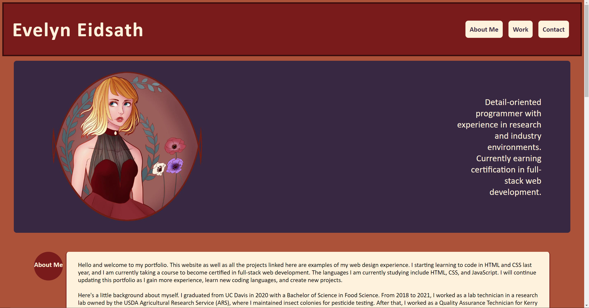
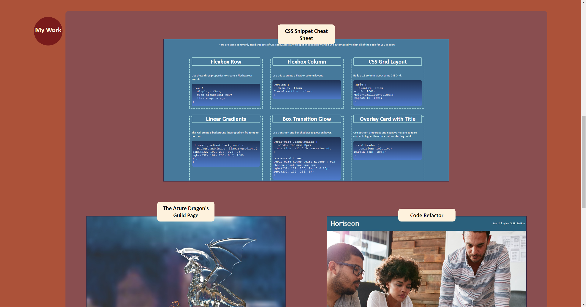
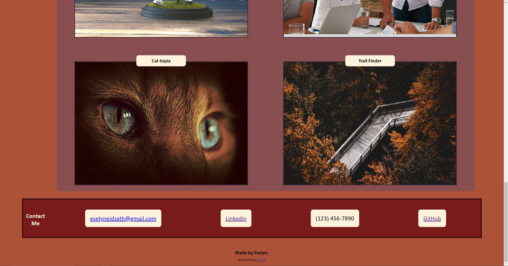
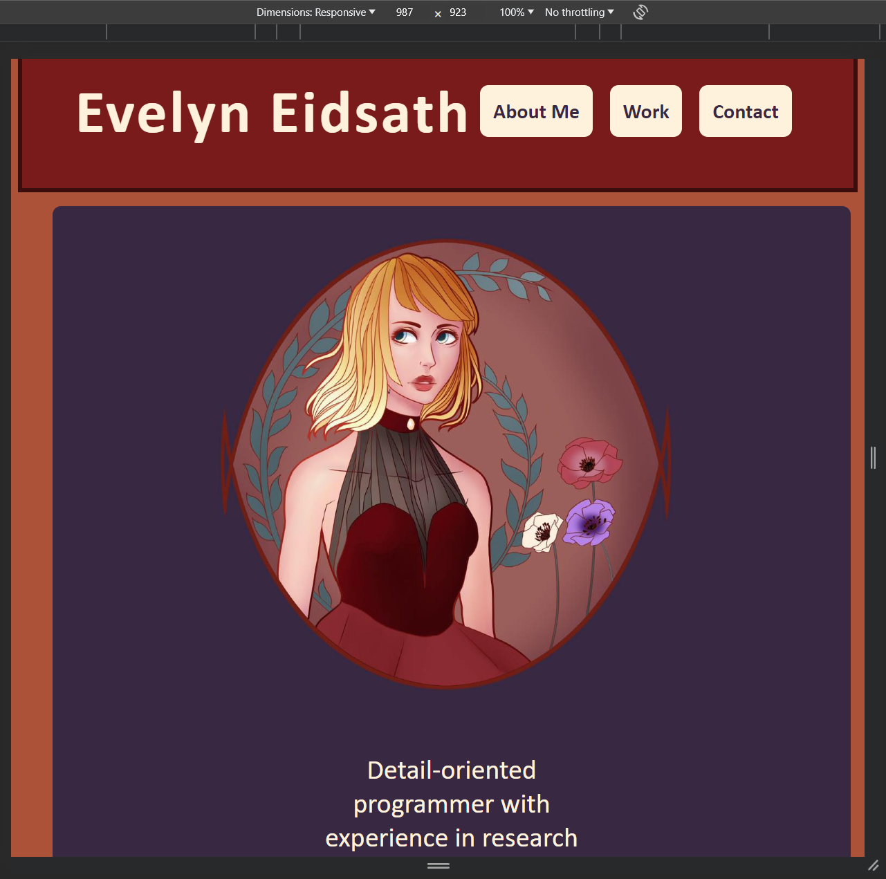
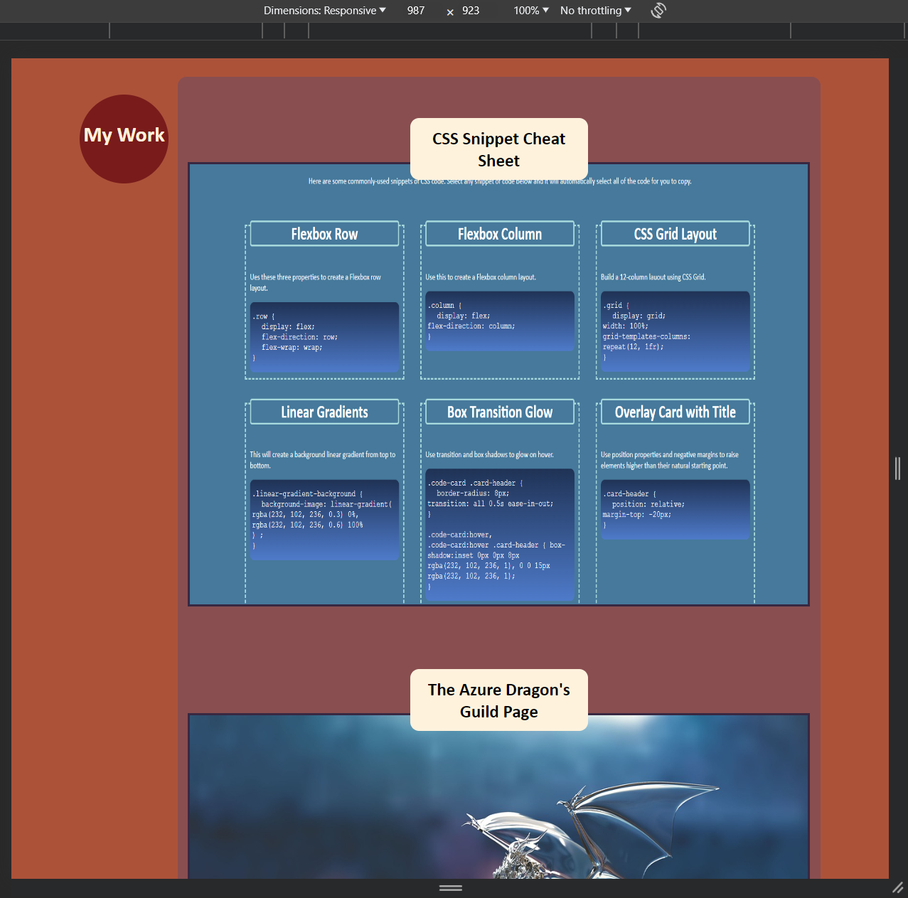

# Evelyn Eidsath's Portfolio

## Description

The goal of this project was to create a portfolio website to display work samples for the reference of prospective employers.

A portfolio is a convenient location to summarize your work experience and history, as well as to share information about yourself that employers might find useful to know. The portfolio is meant to have a clear layout and navigation bar to make it easy for employers to view an individual's personal information, professional work examples, and contact information. This makes the portfolio an ideal reference to use during job searches and networking.

By making this portfolio, I became familiar with the processs of creating a website from scratch. I was able to address the code step-by-step, starting with a wireframe, then establishing the content of the site with HTML, and finally styling each section with CSS. I also learned how to use pseudo-classes to create engaging effects for users. Finally, I became far more acquainted with how flexbox is used to arrange a dynamic layout for various screen sizes.

## Screenshots

### Desktop

### Mobile

## Installation

N/A

## Usage

To view this webpage, enter the URL [https://eaeidsath.github.io/Portfolio/](https://eaeidsath.github.io/Portfolio/) into any browser and scroll to see the webpage content.

For quick navigation, users can click the links in the header at the top of the page named About, Works, and Contact to instantly be brought to the corresponding topic's section on the webpage.

Under the "Works" section, users can hover their mouse over the images corresponding to each titled work, and see the image glow in response. Clicking on the images will open the corresponding project or website in a new tab in the user's browser.

## Credits

Evelyn Eidsath [https://github.com/eaeidsath](https://github.com/eaeidsath)